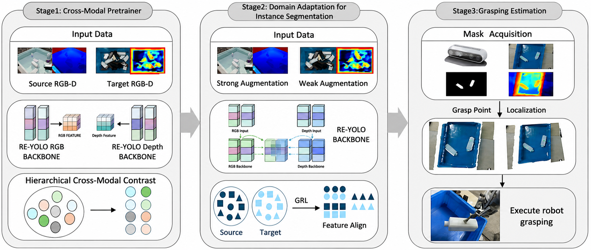
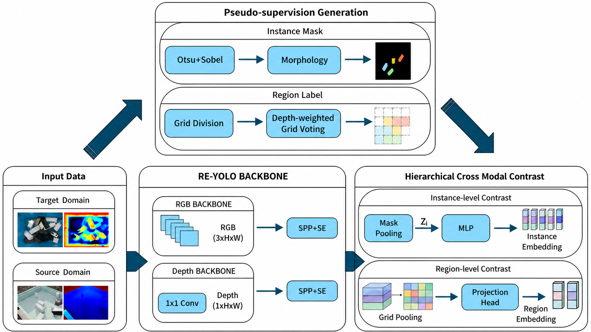

# A Sim-to-Real RGB-D Grasping Framework for Texture-Less Rectangular Bottles
Robotic grasping of texture-less objects in cluttered industrial environments remains challenging due
to limited visual texture, strong specular reflections, severe occlusion, depth noise, and the Sim-
to-Real domain gap. To address these challenges, we first develop Receptive Expansion YOLO
(RE-YOLO), a dual-stream RGB-D instance segmentation network that serves as the perception
backbone. RE-YOLO combines ADOWN, our SRFEM-based RE-C3K2 module, and multi-scale
dense fusion to strengthen weak-boundary perception and geometric feature representation. Building
on RE-YOLO, we propose Cross-Modal Alignment Grasping (CMAG), a three-stage framework
for Sim-to-Real robotic grasping without requiring annotated real-world RGB-D data. In Stage 1,
hierarchical cross-modal contrastive pre-training is performed on unlabeled synthetic and real RGB-
D data to learn transferable representations at both instance and region levels. In Stage 2, asymmetric
GRL-based adversarial adaptation is applied to the RGB branch and cross-modal fusion layers to
align source and target distributions while avoiding excessive alignment of noisy depth features.
In Stage 3, predicted instance masks are back-projected into 3D point clouds, and principal-axis
analysis is used to estimate grasp poses. We also construct and release the Texture-Less Bottle (TLB)
dataset, containing 140,000 synthetic and 2,000 real RGB-D images. RE-YOLO achieves mAP50–95
scores of 89.5% and 91.6% on TLB and Snack Box, respectively. On CDSB and CDTLB, CMAG
reaches 73.1% and 49.0%, improving source-only RE-YOLO by 4.0 and 3.1 percentage points. Real-
robot experiments achieve success rates of 92.5% for static oriented sorting and stacking and 93.1%
for dynamic conveyor-belt picking. 
**The Complete Code and Datasets will be submitted after ours paper is accepts.**

## Datasets Download:

LLVIP: [https: //bupt-ai-cz.github.io/LLVIP/](https://github.com/bupt-ai-cz/LLVIP)

SNACK-BOX: [https: //drive.google.com/file/d/1q8ADmzlx0v_DcgkVKSn5sjA1ZDqhoqtP/view?usp=drive_link](https://github.com/ccteaher/projects-SYN-PBOX)

SNACK-BOX-REAL: We will upload it after the paper is accepted

TLB: We will upload it after the paper is accepted

## Weight Download:

LLVIP: https://drive.google.com/file/d/1O_jvppr2ymWTQc5luIrUfWqq8gpxvleq/view?usp=sharing

SNACK-BOX: https://drive.google.com/file/d/1_Gti5hbO1h27WmCbGO3T24XDoZAzkaSP/view?usp=sharing

TLB: https://drive.google.com/file/d/1GuyaFOt0UrUf8UpFqWdfuDhNu12GIQ46/view?usp=sharing

CROSS_BOX: https://drive.google.com/file/d/1pnM-Z32odrnv86ayp4HQ_fZ-SRmhPoXy/view?usp=sharing

CROSS_TLB: https://drive.google.com/file/d/1MK-hAHTJukLC-G08AXFsH1SHjj4_Arbz/view?usp=sharing

# Grasping demo video:
## Youtube
https://youtu.be/lWrL7XP-W44
https://youtu.be/4HDqdRFd8gE

## BiliBili
https://www.bilibili.com/video/BV1s6RWB1EtJ/?vd_source=c8e55916427f2dee83d3fddf7eb1b7bd

# CMAG: Cross-modal Alignment Grasping

Stage 1: Cross-Modal Pretrainer. Employing self-supervised contrastive learning, joint pretraining is conducted on the backbone network of RE-YOLO using unlabeled training sets from both the source and target domains. This aims to extract domain-agnostic features with strong generalization potential.

Stage 2: Domain Adaptation for Instance Segmentation. Learning is conducted on annotated synthetic data from the source domain and unannotated real-world data from the target domain. By introducing a gradient reversal layer to construct a domain classifier, distribution alignment is performed within the feature space, prompting the network to extract domain-invariant features. This process aims to effectively bridge the gap between virtual and real distributions through the deep fusion of the feature space, ensuring the model possesses robust discriminative power for cross-domain features.

Stage 3: Grasping Estimation. During the inference phase in real-world scenarios, the system utilizes the instance masks output by the RE-YOLO network, combined with depth information, to reconstruct partial point clouds of the objects. It then calculates reliable grasping points and executes the grasp.

## Frame diagram
### 

### 

## Experimental index
### Results on Snack Box dataset
| **Modality** | **Method** | **mAP50** | **mAP50-95** |
|:------------:|:----------:|:---------:|:------------:|
| RGBD         | (2023)YOLOV8      | 95.6     | 90.9      |
| RGBD         | (2024)YOLOV11      | 96.1     | 90.7      |
| RGBD         | (2023)SUPER-YOLO      | 95.4     | 88.6      |
| RGBD         | (2025)DE-YOLO      |95.1    | 89       |
| RGBD         | (2025)MASF        | 95.5     | 90.2        |
| RGBD         | (2025)DS-YOLO | 95.8    | 90.1        |
| RGBD         | ours       | **97.1**    | **91.6**        |

### Results on the LLVIP infrared dataset
| **Modality** | **Method**               | **mAP50** | **mAP50-95** |
|:------------:|:------------------------:|:---------:|:------------:|
| RGB+IR       | (2025)CAMDet           | 96.5    | 62.7       |
| RGB+IR       | (2025)Mamba-Fusion       |**97**    | 63       |
| RGB+IR       | (2025)RSDet          | 95.8     | 65.3        |
| RGB+IR       | (2025)EI²Det   | 98      | 63.9         |
| RGB+IR       | (2025)DS-YOLO     | 97     | 65.3         |
| RGB+IR       | (2025)VIF_YOLO          | 96.3     | 64.5        |
| RGB+IR       | ours                     | **97**     | **66.3**        |

### Results on the TLB  dataset
| **Modality** | **Method**               | **mAP50** | **mAP50-95** |
|:------------:|:------------------------:|:---------:|:------------:|
| RGBD         | (2023)YOLOV8      | 95.8     | 88     |
| RGBD         | (2024)YOLOV11      | 96.2     | 88.9      |
| RGBD        | (2025)AS-YOLO           | 95.7    | 89.4       |
| RGBD        | (2025)CFT       |**98.4**   | 84       |
| RGBD        | (2025)DE-YOLO   | 94.2      | 88.1        |
| RGBD        | (2025)DS-YOLO     | 96     | 88.8         |
| RGBD        | ours                     | **97**       | **89.5**        |

### Results on the Cross Domain Snack Box   dataset
| **Modality** | **Method**               | **mAP50** | **mAP50-95** |
|:------------:|:------------------------:|:---------:|:------------:|
| RGBD         | (2017)Cyclegan      | 83.4    | 67.8     |
| RGBD         | (2025)DS-YOLO      | 80     | 63      |
| RGBD        | RE-YOLO           | 84.6    | 69.1       |
| RGBD        | ours                     | **85.5**     | **73.1**        |

### Results on the Cross Domain TLB  dataset
| **Modality** | **Method**               | **mAP50** | **mAP50-95** |
|:------------:|:------------------------:|:---------:|:------------:|
| RGBD         | (2017)Cyclegan      | 63.4     | 41.3     |
| RGBD         | (2025)DS-YOLO      | 62.1     | 40.7      |
| RGBD        | RE-YOLO     | 64.2     | 45.9         |
| RGBD        | ours                     | **67.8**      | **49**        |
