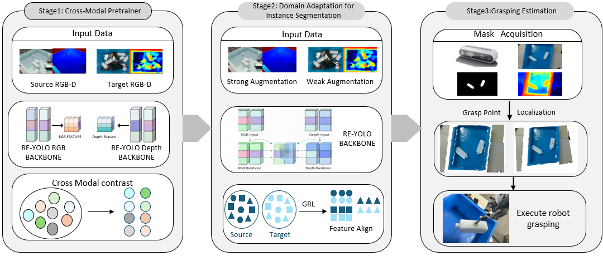

# A Grasping Method Based on Domain Generalization for Texture-Less Rectangular Bottles
A Multi Stage Domain Adaptation Strategy Framework for Grasping Solid Colored, No Texture, Recutangle Bottled Objects.
The Complete Code and Datasets will be submitted after ours paper is accepts

## Datasets Download:

### baidu pan
Link： 
Code： 

# CMAG: Cross-modal Alignment Grasping

Stage 1: Cross-Modal Pretrainer. Employing self-supervised contrastive learning, joint pretraining is conducted on the backbone network of RE-YOLO using unlabeled training sets from both the source and target domains. This aims to extract domain-agnostic features with strong generalization potential.

Stage 2: Domain Adaptation for Instance Segmentation. Learning is conducted on annotated synthetic data from the source domain and unannotated real-world data from the target domain. By introducing a gradient reversal layer to construct a domain classifier, distribution alignment is performed within the feature space, prompting the network to extract domain-invariant features. This process aims to effectively bridge the gap between virtual and real distributions through the deep fusion of the feature space, ensuring the model possesses robust discriminative power for cross-domain features.

Stage 3: Grasping Estimation. During the inference phase in real-world scenarios, the system utilizes the instance masks output by the RE-YOLO network, combined with depth information, to reconstruct partial point clouds of the objects. It then calculates reliable grasping points and executes the grasp.

**The source code will be submitted after the paper is accepted.**
# Grasping demo video:
## Toutube
https://youtu.be/lWrL7XP-W44

## BiliBili
https://www.bilibili.com/video/BV1s6RWB1EtJ/?vd_source=c8e55916427f2dee83d3fddf7eb1b7bd

## Frame diagram
### 

## Experimental index
### Results on a jumbled stacked box-shaped dataset
| **Modality** | **Method** | **mAP50** | **mAP50-95** |
|:------------:|:----------:|:---------:|:------------:|
| RGBD         | (2023)YOLOV8      | 95.6     | 90.9      |
| RGBD         | (2024)YOLOV11      | 96.1     | 90.7      |
| RGBD         | (2023)SUPER-YOLO      | 95.4     | 88.6      |
| RGBD         | (2025)DE-YOLO      |95.1    | 89       |
| RGBD         | (2025)MASF        | 95.5     | 90.2        |
| RGBD         | (2025)DS-YOLO | 95.8    | 90.1        |
| RGBD         | ours       | **97.1**    | **91.6**        |

### Results on the LLVIP infrared dataset
| **Modality** | **Method**               | **mAP50** | **mAP50-95** |
|:------------:|:------------------------:|:---------:|:------------:|
| RGB+IR       | (2025)CAMDet           | 96.5    | 62.7       |
| RGB+IR       | (2025)Mamba-Fusion       |97    | 63       |
| RGB+IR       | (2025)RSDet          | 95.8     | 65.3        |
| RGB+IR       | (2025)EI²Det   | 98      | 63.9         |
| RGB+IR       | (2025)DS-YOLO     | 97     | 65.3         |
| RGB+IR       | (2025)VIF_YOLO          | 96.3     | 64.5        |
| RGB+IR       | ours                     | 97      | **66.3**        |

### Results on the WTB infrared dataset
| **Modality** | **Method**               | **mAP50** | **mAP50-95** |
|:------------:|:------------------------:|:---------:|:------------:|
| RGBD         | (2023)YOLOV8      | 95.8     | 88     |
| RGBD         | (2024)YOLOV11      | 96.2     | 88.9      |
| RGBD        | (2025)AS-YOLO           | 95.7    | 89.4       |
| RGBD        | (2025)CFT       |98.4    | 84       |
| RGBD        | (2025)DE-YOLO   | 94.2      | 88.1        |
| RGBD        | (2025)DS-YOLO     | 96     | 88.8         |
| RGBD        | ours                     | 97      | **89.5**        |

### Results on the Cross Domain WTB infrared dataset
| **Modality** | **Method**               | **mAP50** | **mAP50-95** |
|:------------:|:------------------------:|:---------:|:------------:|
| RGBD         | (2017)Cyclegan      | 83.4    | 67.8     |
| RGBD         | (2025)DS-YOLO      | 80     | 63      |
| RGBD        | RE-YOLO           | 84.6    | 69.1       |
| RGBD        | ours                     | 85.5      | **73.1**        |

### Results on the Cross Domain Snack Box infrared dataset
| **Modality** | **Method**               | **mAP50** | **mAP50-95** |
|:------------:|:------------------------:|:---------:|:------------:|
| RGBD         | (2017)Cyclegan      | 63.4     | 41.3     |
| RGBD         | (2025)YOLOV11      | 62.1     | 40.7      |
| RGBD        | DS-YOLO     | 64.2     | 45.9         |
| RGBD        | ours                     | **67.8**      | **49**        |
